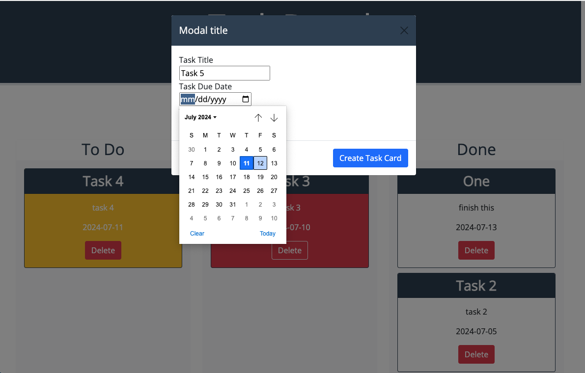

# Kanban Board

## Description

This application allows users to add tasks to a kanban board with dates for completion. The tasks can then be dragged into the appropriate column as they are worked. The background color will update to yellow if the task is due soon, or red if the task is overdue.

## Deployed Site

https://egodschalk.github.io/kanban-board-take2

## GitHub Repo

https://github.com/egodschalk/kanban-board-take2

## Notes

This application was built in a separate repo with an incorrect file structure and had to be moved into this repo for deployment. The commit history is lacking because of this.

## Screenshots

